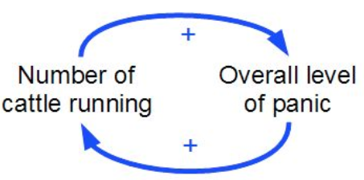

# The Cybernetic Roots of Nouvelle AI

## Nouvelle AI:

- Novelle AI revolves around the idea that behaviour emerges from the dynamic interation between brain/body and environment

- Its aim is to produce artificial intelligence similar to that of insects.

- Researchers believe that inelligence can emerge organically from simple behaviours when interacting with "the real world".

- This is very different from symbolic ai since they use "constructed worlds built into them" when trained.

## Two types of intelligence problems:

- playing chess:
    - offline
    - static
    - no body needed

- Cleaning:
    - real physical tasks
    - Engaged
    - Dynamic
    - Needs a body

We are really bad at designing AI that embody machines.

## Cybernetics:

- cybernetics is the use of machines acting in the real world to solve a problem.

## Positive Feedback:

- The idea that the more something happens, the more likely it is to happen in the future.

- It moves away from equilibrium

- state( t + 1 ) = state( t ) * 2

- e.g. 1, 2, 4, 8, 16, 32, 64, 128...

**Real life example:**

## Negative feedback:

- Essentially, negative feedback is the opposite of positive feedback.

- The less something happens the less it will happen in the future.

- It settles at equilibrium

- It is good at stabilising small 
systems. 
    - e.g. you hit a bump riding a bike.
    
    - We make very small unnoticeable adjustments until we're stable.

