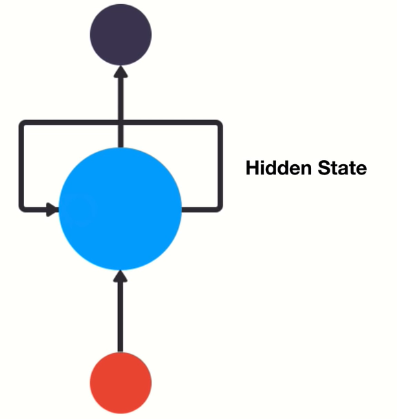
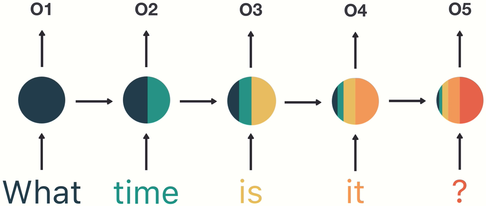
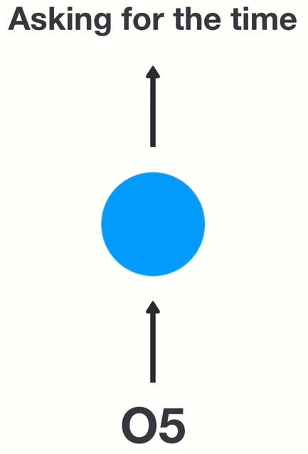
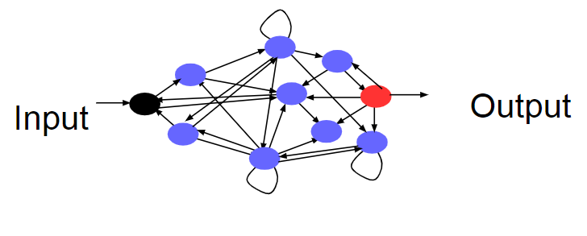
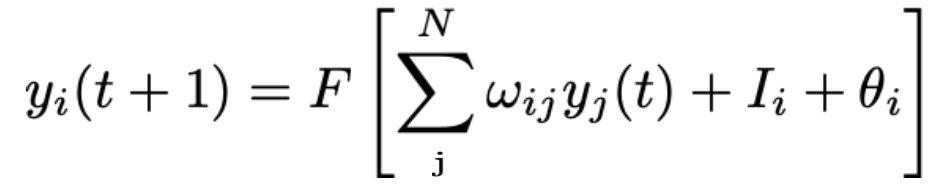

# Recurrent Neural Networks

## what are RNNs:
- They are neural networks that use previous outputs to predict future outputs.
- They have a concept of sequential memory.

---

## Visual example of RNN:

#### Recurrent neural network:

- It has a connection that passes previous outputs to itself.

#### Working example:

- This example looks at how a sentence can be classified by looking at its previous state. 

- The stored output could then be used to classify an intent.

---

## Recurrence in the brain

- Brains aren't feed forward, they are highly recurrent

- Cennection goes forwards and backwards in cycles

- There is feedback between neurons everywhere.

---

## RNN formula:

#### Formula:

#### What the sections of the formula mean:

    'y' is each node in the network
    'w' represent the weights
    't' represents time
    'I' represents input
    feta represents the bias

yi( t + 1 ) represents the value 'yi' in the next timestep.

---

## Transfer function:

- Transfer functions are used to keep the outputs in range.