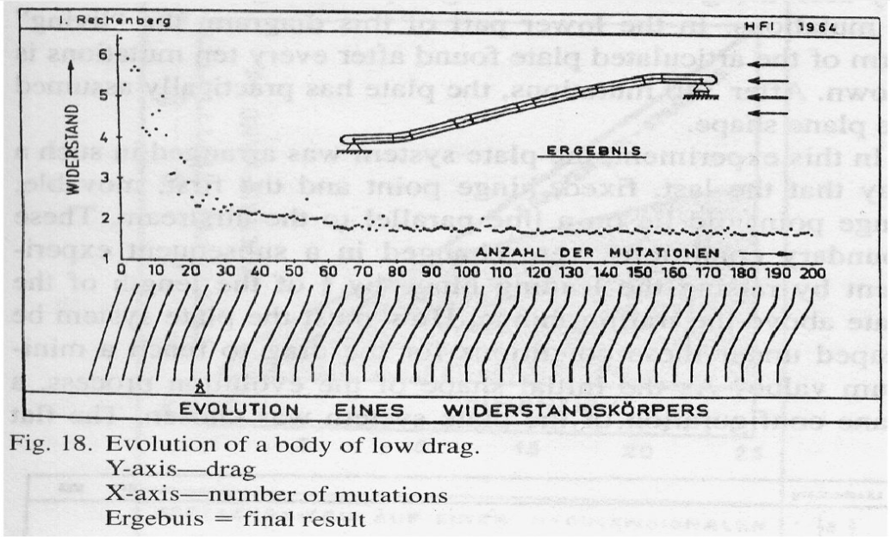
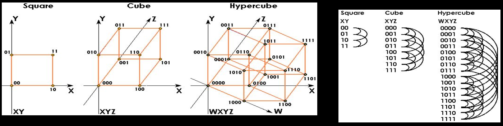
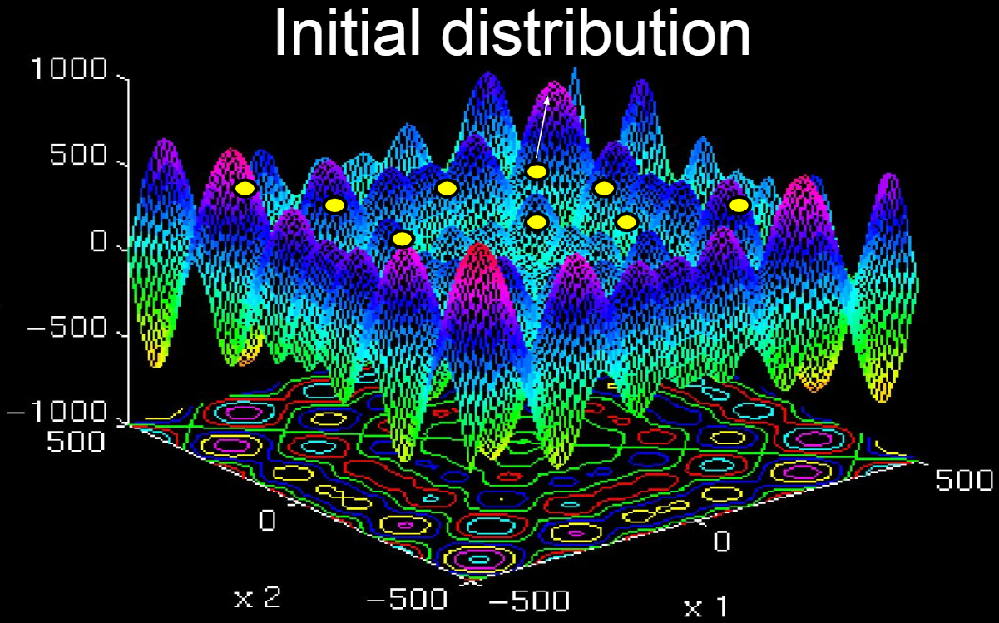
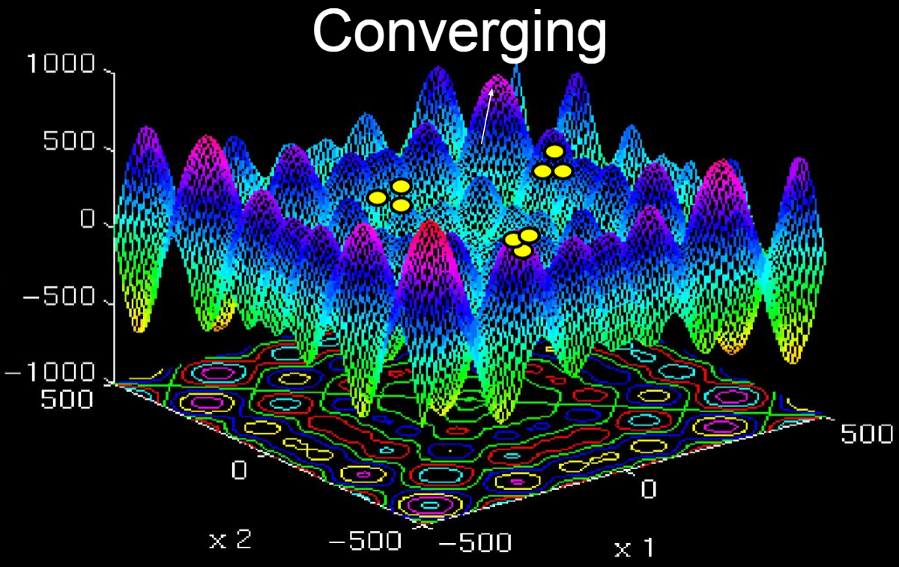
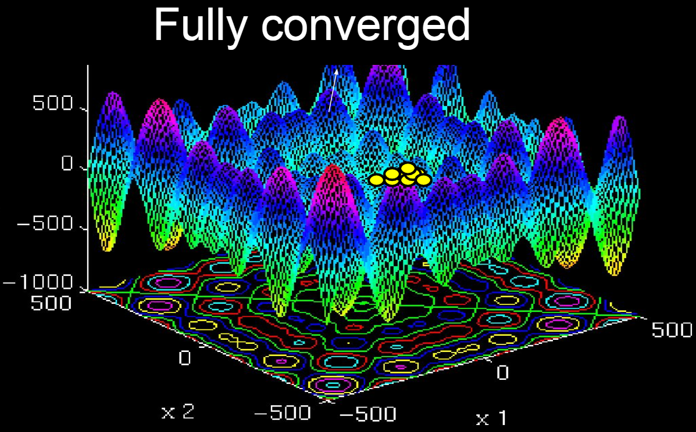

# Evolution as Search

## An example:
- A reason we might want to use evolution as search is to save time.
    - Imagine the 5 joint angles can be adjusted through 90 degrees in 1 degree steps
    - There are 90^5 = 5,904,900,000 genotypes
    - If we could test 100 per second, it would take 683 days to test them all
    - So we don't want to check them all...

A hill climber algorithm can be used to check this as we discussed in the last notes .md

## An example relating to our engineering example from the last notes:

## Patterns in a search space:

- A GA assumes that there is a trend in our search space. That is why GAs tend to go from low fitness to high fitness, developing through trends.

## visualising a hill-climber:

- A hill-climber can be cisualised as hills. the fitness is measured as the height of the hill. There can be lots of different hills with different heights all being different local optimas.

## high dimentionality

- The more genes you have, the larger your search space will be

visual example:

## Neural networks with hill-climbers:

- Therefore, a higher dimentionality makes it more difficult to search. This makes it "bad."
    - With this disadvantage may come an advantage. This is neural networks. A larger search space gives way to the oportunity of using neural networks alongside hill climbers.

It will affect the hill climber in the following way:

## Population Genetic Algorithm

In nature, organisms evolve in populations. That is where a population GA takes inspiration from.

Steps for a population GA:

    1. Initialise a solution P
    2. Evaluate P
    3. Allocate memory for a temporary pop P'
    4. Select individual O proportional to their fitness
    5. Mutate O and add to P'
    6. Until P' is full, goto 5
    7. Replace P with P'
    8. Until success or give up, goto 2

## Implementing a population GA (Psuedo code)

    Initialise P 'individuals' --> Pop
    Until (Satisfied or no further improvement)
        Evaluate all individuals
    
    For i=1 to P; Quality(Pop[i]) --> Fitness[i]; End
        Select individuals based on fitness
        
    For i=1 to P;
        pick individual i with probability proportional to fitness
        add mutate(Pop[i]) to new population Pop2
    End
        
    Copy old population to new population
    Pop2 --> Pop;
    Output best individual

## Creating a population

Genotype:
    [a1, a2, a3, a4, a5, a6, a7, a8
     a1, a2, a3, a4, a5, a6, a7, a8
     a1, a2, a3, a4, a5, a6, a7, a8
     a1, a2, a3, a4, a5, a6, a7, a8]

Fitness:
    [fa
     fb
     fc
     fd]

## Benifits of a population > 2:

- Unlike a hill climber, this GA has a population greater than 2
- This helps us explore the search space
- And can help avoid (but not prevent) getting stuck in local optima

## Visualisation of how population GAs develop:

## Convergence:

- The population may converge too quickly
    - the variety in the population decreases over time because of selection

- A converged population is not "spread out" in the search space, and so starts to have similar problems to the hill-climber

## How can we discourage convergence:

- Mutation Rate
- The challenge of making an effective GA is in balancing convergence 
    - and also exploration of the search space (variety)
